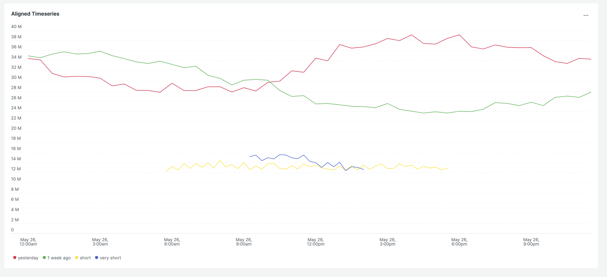

# New Relic Custom Visualisation: Aligned Timeseries

This custom visualisation allows you to plot multiple timeseries data on a single chart. Each series of data is adjusted so that they match the x-axis of the most recent timeseries. This allows you to compare event windows from different periods to perform easier comparisons.

For each series you can:
- specify the NRQL (I recommend labelling your series using the 'as' keyword in the query) 
- specify the line colour using CSS name or hex value (e.g. 'red' or '#ff0000')

You may choose how the series are aligned. They can be aligned to start at the same time, end at the same time or align in the middle.

You may also provide your own colour map to save entering individual colours. Simply provide a comma seperated list of hex or CSS colours in the configuration. Not specifying a colour will use the default pallete)


## Testing

Run the following scripts:

```
npm install
npm start
```

Visit https://one.newrelic.com/?nerdpacks=local and :sparkles:


## Installing

Run the following after ensuring you have selected your nr1 profile  with `nr1 profiles:default`:

Generate a UUID (only do this once):
```
nr1 nerdpack:uuid -gf 
```

Publish to New Relic:
```
nr1 nerdpack:publish
nr1 nerdpack:deploy
```

Subscribe your account:
```
nr1 subscription:set
```

You should now find the custom visualisation in the "Custom Visuaslizations" app.

